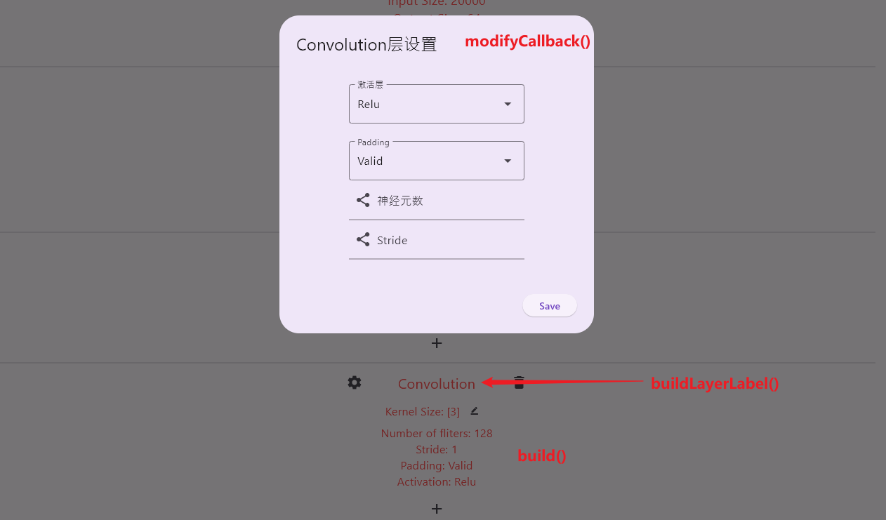
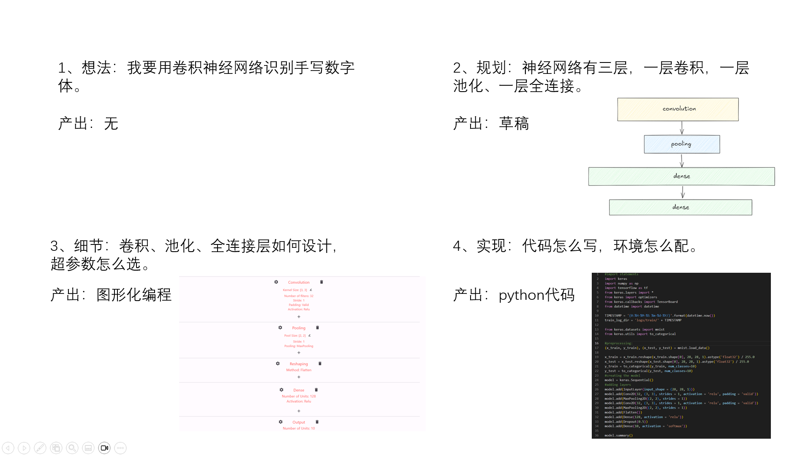

# 对后来者：如何修改这个程序

平心而论这个写的很烂啊，是本人的第一个flutter项目，现学现卖做的。直到完成时还是不怎么会flutter，很多地方都处于“能用，但不太好用”的状态。代码结构一团乱麻，优化和泛用性一坨，想必在这上面做扩展会非常折磨吧。

## 添加新的层

现有的层都是根据keras3 api设计和分类的，且默认结构为sequential，如果想要更复杂的结构，建议看下一大章节的建议推倒重做。以MultiHeadAttention层为例，要想添加新的层，有以下几步：

### 修改layer_serialize.dart

该文件描述了如何序列化和反序列化。MultiHeadAttention中，num_heads和key_dim参数是必须的。我们可以在LayerInfo类中添加`int? numHeads`和`int? keyDim`成员，并补充序列化和反序列化的代码。

### 修改code_widget.dart

该文件描述了添加新层时的行为，包括LayerInfo和xxxLayerWidget的实例化。首先我们在`initLayerInfo`中描述初始化信息：

``` dart
LayerInfo initLayerInfo(String type) {
  switch (type) {
    ...
    case 'MultiHeadAttention':
      return LayerInfo(type: type)
        ..numHead = 123
        ..keyDim = 456;
    ...
  }
}
```

以上代码中的`String type`来自按下`+`按钮后的选择结果，可选项记录在`CodeWidgetState.validLayerType`中。为了将新选项渲染到页面上，我们还需要修改`CodeWidgetState.fromType()`

``` dart
class CodeWidgetState extends State<CodeWidget> {
  ...
  final List<String> validLayerType = [
    ...
    // transfer to LayerInfo.type
    'MultiHeadAttention',
  ];

  BaseLayerWidget fromType(String type, int hash) {
    switch (type) {
      ...
      case 'MultiHeadAttention':
        widget = DMultiHeadAttentionLayerWidget(
          hash: hash,
          deleteCallback: () => deleteLayer(hash),
        );
    }
    return widget;
  }
}
```

### 修改common_layer.dart

该文件描述xxxLayerWidget的显示效果。一个正确的xxxLayerWdiget应具有如下结构：

``` dart
class MultiHeadAttentionLayerWidget extends BaseLayerWidget {
  const MultiHeadAttentionLayerWidget(
      {super.key, required super.hash, required this.deleteCallback});

  final void Function() deleteCallback;
  final String label = 'MultiHeadAttention'; // optional

  @override
  State<MultiHeadAttentionLayerWidget> createState() => _MultiHeadAttentionLayerWidgetState();
}

class _MultiHeadAttentionLayerWidgetState extends State<MultiHeadAttentionLayerWidget> {
  late LayerInfo layerInfo;

  // config dialog layout 
  void modifyCallback() async {
    
  }

  // layout in code widget
  @override
  Widget build(BuildContext context) {
    layerInfo = GlobalVar.getLayer(widget.hash);
    return Container();
  }
}
```

在`modifyCallback()`中设置修改详细内容时的弹窗效果。设计可参考相关代码，不再赘述。

在`build()`中设置在页面上的显示效果。对于label的设计建议用`buildLayerLabel()`函数，统一一些。



### 修改global.dart

该文件描述怎样将设置变成python代码。根据自己的实际需求改就行。

``` dart
for (LayerInfo layer in model.layers) {
    switch (layer.type) {
        case 'MultiHeadAttention':
        code +=
            'model.add(MultiHeadAttention(${layer.numHead!}, ${layer.keyDim}))\n';
        break;
    }
}
```

## 添加新的数据集

现有数据集是keras3自带的小数据集，完全可以从其他地方加载。大概分为以下几步：

### 修改leftmenu_widget.dart

修改`LeftMenuWidgetState.validDatasetType`，直接加在里面就行。

### 修改global.dart

为了免除学生做数据预处理的折磨，建议自己把预处理的代码写好、测好、注释好。可千万不要偷懒不做预处理，折磨学生最终折磨的是自己。

# 对志向远大者：如何颠覆这个程序

我有一个宏伟构想，但没时间实现。志向远大者可以试一下。

## 基本思路

从想法到实现分为以下四步：



目前99%的无代码编程平台都是面向第一步（ai assistant like）和第三步（blockly like）的。他们各自特点如下：

根据想法生成代码：

- 好处：
  1. 抽象层次高，易于理解和传授。
  2. 好玩。
- 坏处：
  1. 即使有很清晰的想法，得到的结果和乱想的人差不多，不利于求知。
  2. 只需要几个关键词就能输出既定的结果，但也只能输出预训练好的结果，不利于发挥想象。
  3. 可解释性差，不知道为啥可以，也不知道为啥不行。

根据细节生成代码：

- 好处：
  1. 像编译器一样生成准确代码，图形界面和代码一对一映射，逻辑清晰。
  2. 觉得图形化操作太麻烦的人能够借此光速学会代码编程，无师自通。
- 坏处：
  1. 一点都不好玩，尤其对于开发者。
  2. 函数功能千千万，永远不可能做完所有的一对一映射，开发难度大。
  3. 正由于2所述，普遍功能简陋且操作反人类。

既然如此，我们为啥不结合二者，设计出“根据草稿生成代码”的无代码编程平台呢？在我的设想中，它应该具有以下要素：

1. 游戏性高：设计成解谜闯关类游戏。
2. 答案唯一但解法不唯一：编译器只输出“正确”和“不正确”（或离正确答案还差多少），与标准草稿接近的解法都判定为正确。
3. 解题思路固定：每一关考验特定的解题思路，在范围内才行，避免捷径/万用解，这样才有教学性。

待续。。。